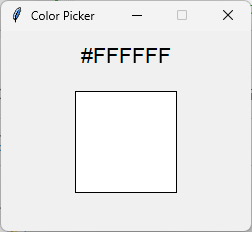

# Color Picker

A simple Windows color picker tool built in Python that allows you to capture the color of any pixel on your screen. With a global mouse listener and a GUI that always stays on top, this tool automatically copies the hexadecimal color code to your clipboard and displays a preview.



## Features

- Global Mouse Listener: Capture mouse clicks anywhere on the screen.
- Color Extraction: Retrieve the pixel color and convert it to a hexadecimal code.
- Clipboard Integration: Automatically copy the color code to your clipboard.
- Simple GUI: A Tkinter interface that displays the color code and a preview rectangle.
- Always on Top: The window stays above all other windows.
- Dual-Monitor Support: Works on multi-monitor setups.

## Requirements

- Python 3.x
- [pynput](https://pypi.org/project/pynput/)
- [mss](https://pypi.org/project/mss/)
- [pyperclip](https://pypi.org/project/pyperclip/)
- [Pillow](https://pypi.org/project/Pillow/)
- [Tkinter](https://docs.python.org/3/library/tkinter.html) (usually bundled with Python)

## Installation

1. Clone the Repository:

   ```bash
   git clone https://github.com/yswqq/color_picker.git
   cd color_picker
   ```

2. (Optional) Create and Activate a Virtual Environment:

   ```bash
   python -m venv venv
   # On Windows:
   venv\Scripts\activate
   # On macOS/Linux:
   source venv/bin/activate
   ```

3. Install the Dependencies:

   ```bash
   pip install -r requirements.txt
   ```

   *Alternatively, install manually:*

   ```bash
   pip install pynput mss pyperclip pillow
   ```

## Usage

### Running the Application from Source

Simply run the Python script:

```bash
python color_picker.py
```

The GUI will appear (always on top) showing the color code at the top and a rectangle preview at the bottom. Click anywhere on your screen to capture the color; the hex code is copied to your clipboard automatically.

### Using the Executable

A pre-built executable (`color_picker.exe`) is available in this repository. You can run it directly on Windows without installing Python.

## Building the Executable

To create your own executable using PyInstaller:

1. Install PyInstaller:

   ```bash
   pip install pyinstaller
   ```

2. Build the Executable:

   ```bash
   python -m PyInstaller --onefile --windowed color_picker.py
   ```

   The executable will be located in the `dist` folder.

## Contributing

Contributions are welcome! Please feel free to open an issue or submit a pull request with improvements, bug fixes, or suggestions.

## License

This project is licensed under the [MIT License](LICENSE).

## Acknowledgments

- Built with Python and Tkinter.
- Thanks to the developers of [pynput](https://pypi.org/project/pynput/), [mss](https://pypi.org/project/mss/), [pyperclip](https://pypi.org/project/pyperclip/), and [Pillow](https://pypi.org/project/Pillow/).
